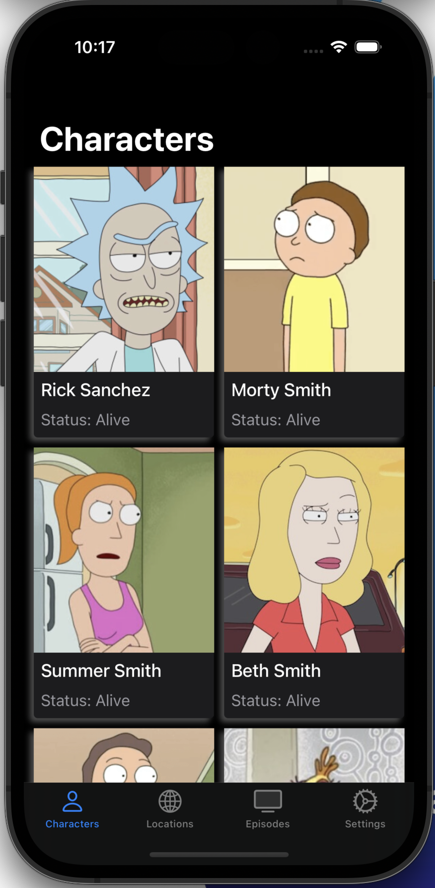

# RickAndMorty

Esse projeto está sendo desenvolvido para estudo e conhecimentos gerais em Swift. Ao longo do projeto irei consumir a API do [Rick and Morty;](https://rickandmortyapi.com)

* A arquitetura do projeto vai ser em VIP;
* A navegação do projeto vai ser COORDINATOR
* Não será  utilizando Storyboard;
* API [Rick and Morty;](https://rickandmortyapi.com)
  __________
  ### Tela de Lista de personagens (Characters)
  * Essa tela carrega 20 personagens por vez, ao chegar no "final", ela carrega mais 20 personagens que vem da API.
<h4 align="center">
    
</h4>
